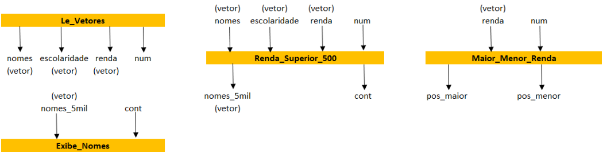

Cadastro básico de clientes e rendas, utilizando variáveis de referência para as funções

# Exercício de ponteiros com struct

O objetivo do exercício é utilizar ponteiros para preencher dados de uma struct Clientes.

1. Le_Vetores: usada para ler do teclado 3 vetores com as seguintes informações sobre cada
cliente de uma empresa (máximo 200 clientes): nome, nível de escolaridade (“fundamental”, “médio” ou
“superior”) e renda mensal. O número de clientes cadastrados deve ser retornado por esta função.
2. Renda_Superior_5000: que recebe como parâmetros de entrada os vetores com nomes,
escolaridades e rendas e quantos cliente foram cadastrados. Como resultado da função deve ter como
saída um vetor com apenas os nomes dos clientes com nível de escolaridade “médio” e renda superior a
R$5mil e também tem como saída o número de clientes que satisfazem essa condição e que foram
inseridos no vetor de saída.
3. Maior_e_Menor_Renda: que recebe como parâmetros de entrada o vetor com as rendas dos
clientes e número de clientes cadastrados e, em seguida, encontra o maior e o menor valor de renda.
Como parâmetro de saída, a função deve retornar para a função main os índices do vetor onde encontrou
a maior e menor renda de todo o grupo de clientes.
4. Exibe_Nomes: usada para apresentar na tela de saída o vetor gerado no item b (função
Renda_Superior_5000).

## Exemplificação de parâmetros para cada função solicitada

    

